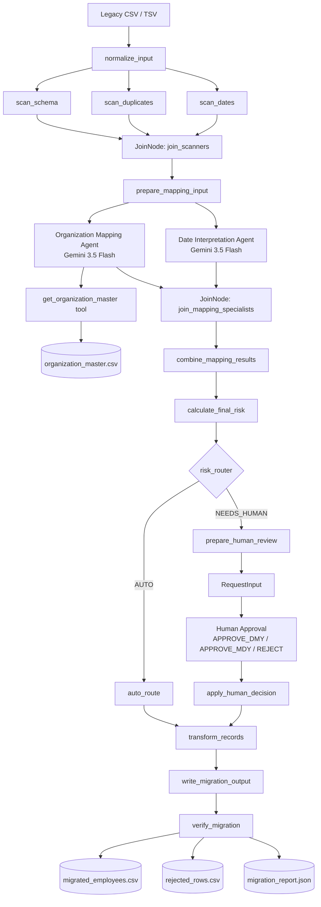

# SchemaPilot

**Autonomous legacy data migration with Google ADK, Gemini, deterministic policy gates, and human-in-the-loop approval.**

> Built for the **All Things Agentic Hackathon — The Taskmaster track**.

SchemaPilot turns a messy legacy migration job into an end-to-end agentic workflow. Instead of only explaining what is wrong with a source file, it profiles the data, delegates semantic interpretation to specialist agents, pauses for human approval when risk is high, transforms safe records, rejects unsafe records with reasons, writes migration artifacts, and verifies that no source rows were lost.

## Why SchemaPilot

Legacy migrations are rarely simple ETL jobs. Real datasets contain malformed exports, inconsistent organization names, ambiguous dates, duplicates, missing values, and business rules that should not be left entirely to an LLM.

SchemaPilot separates **reasoning** from **policy enforcement**:

- Gemini specialists reason about semantic mappings and ambiguous values.
- Deterministic Python nodes enforce schema, risk thresholds, transformation rules, and reconciliation.
- Human approval is required when the system cannot safely decide on its own.

This matches the Taskmaster goal: **complete a real workflow, not just produce text**. The hackathon requires Gemini 3.5+, a Google agent framework, and at least one Google Cloud infrastructure service for the final submission. The current repository contains the working local/Vertex AI backend MVP; Cloud Run deployment is the next production-readiness milestone.

## Current MVP status

| Capability | Status |
|---|---:|
| Legacy file ingestion | ✅ |
| UTF-8 / BOM / Vietnamese text handling | ✅ |
| Delimiter detection | ✅ |
| Recovery from whole-row quoted TSV exports | ✅ |
| Parallel schema / duplicate / date profiling | ✅ |
| JoinNode fan-in | ✅ |
| Organization Mapping Agent | ✅ |
| Date Interpretation Agent | ✅ |
| Tool call to organization master data | ✅ |
| Parallel specialist execution | ✅ |
| Deterministic risk routing | ✅ |
| Human-in-the-loop approval | ✅ |
| Pause → approve → resume | ✅ |
| Deterministic transformation | ✅ |
| Rejected-row handling | ✅ |
| Migration output files | ✅ |
| Reconciliation / data-loss verification | ✅ |
| Idempotency | ⏳ Next |
| Durable crash recovery | ⏳ Next |
| REST API | ⏳ Planned |
| Production frontend | ⏳ Planned |
| Cloud Run deployment | ⏳ Required before submission |

## Architecture



## Design principles

### 1. Use AI only where reasoning adds value

Schema checks, duplicate detection, date parsing, routing thresholds, transformation, and reconciliation are deterministic Python logic. Gemini is used for semantic tasks such as mapping legacy department labels to authoritative organization master data.

### 2. The LLM never owns the final migration policy

A specialist may identify uncertainty, but the workflow decides whether the case is `AUTO` or requires human review. Ambiguous slash dates are never guessed.

### 3. Fail safely

If SchemaPilot cannot parse the expected source schema, it stops the migration instead of silently rejecting every row. Invalid dates and unresolved organization mappings are rejected with explicit reasons.

### 4. Verify after acting

A migration is only considered successful when:

```text
source_rows = migrated_rows + rejected_rows
```

and:

```text
data_loss_rows = 0
```

Migrated output is also revalidated for employee-code uniqueness, ISO dates, required fields, and valid organization IDs.

## Example run

Sample input:

```text
EMP_CODE  FULL_NAME        DOB         DEPARTMENT
E001      Nguyen Van An    01/04/1990  Finance
E002      Tran Thi Binh    1992-05-12  FIN
E003      Tran Thi Binh    1992-05-12  Finance Dept
E004      Le Thu Hoa       03/04/1994  Tài chính
E005      Pham Minh Long   1995-13-40  IT
```

The current sample intentionally contains ambiguous dates and an invalid date so the workflow can demonstrate its risk controls.

After human approval with `APPROVE_DMY`, a successful test run produced:

```text
status: MIGRATION_COMPLETED_WITH_REJECTIONS
migration_successful: true
source_rows: 5
migrated_rows: 3
rejected_rows: 2
accounted_rows: 5
data_loss_rows: 0
reconciliation_ok: true
output_valid: true
```

Example migrated record:

```json
{
  "employee_code": "E001",
  "full_name": "Nguyen Van An",
  "date_of_birth": "1990-04-01",
  "org_id": 120
}
```

## Repository structure

```text
all-things-agentic/
├── sample_data/
│   ├── employees.csv
│   ├── organization_master.csv
│   └── target_schema.json
│
├── schemapilot_agent/
│   ├── __init__.py
│   ├── agent.py
│   └── mapping_team.py
│
├── migration_output/        # generated locally; gitignored
├── .gitignore
└── README.md
```

### Main files

- `schemapilot_agent/agent.py` — graph workflow, deterministic profiling, risk routing, HITL, transformation, output, and verification.
- `schemapilot_agent/mapping_team.py` — Gemini specialist agents and organization-master tool.
- `sample_data/employees.csv` — synthetic legacy employee dataset.
- `sample_data/organization_master.csv` — authoritative target organization master.
- `sample_data/target_schema.json` — target migration schema.

## Technology stack

- **Gemini 3.5 Flash**
- **Vertex AI**
- **Google Agent Development Kit (ADK 2.x)**
- Python 3.11+
- Google Cloud authentication via Application Default Credentials for local development
- **Cloud Run** — planned deployment target for the hackathon submission

## Local setup

### 1. Clone the repository

```bash
git clone <YOUR_REPOSITORY_URL>
cd all-things-agentic
```

### 2. Create a virtual environment

Windows PowerShell:

```powershell
python -m venv .venv
.\.venv\Scripts\Activate.ps1
```

macOS / Linux:

```bash
python3 -m venv .venv
source .venv/bin/activate
```

### 3. Install ADK

```bash
pip install "google-adk>=2.6.3"
```

If the project later adds a pinned `requirements.txt`, prefer installing from that file.

### 4. Configure Google Cloud authentication

Enable Vertex AI in your Google Cloud project:

```bash
gcloud services enable aiplatform.googleapis.com --project=<YOUR_PROJECT_ID>
```

Authenticate Application Default Credentials:

```bash
gcloud auth application-default login
gcloud auth application-default set-quota-project <YOUR_PROJECT_ID>
```

Verify authentication:

```bash
gcloud auth application-default print-access-token
```

### 5. Create `schemapilot_agent/.env`

Do **not** commit this file.

```env
GOOGLE_GENAI_USE_VERTEXAI=True
GOOGLE_CLOUD_PROJECT=<YOUR_PROJECT_ID>
GOOGLE_CLOUD_LOCATION=global
```

### 6. Validate the workflow

```bash
python -c "from schemapilot_agent.agent import root_agent; print('ROOT AGENT OK')"
```

Expected:

```text
ROOT AGENT OK
```

### 7. Start ADK Dev UI

```bash
adk web --port 8000
```

Open:

```text
http://127.0.0.1:8000
```

Choose `schemapilot_agent`, create a new session, and send the path to the synthetic sample file.

Example on Windows:

```text
C:\path\to\all-things-agentic\sample_data\employees.csv
```

When the Human Input card appears, respond **inside the RequestInput card**, not in the general chat box:

```text
APPROVE_DMY
```

Supported MVP decisions:

- `APPROVE_DMY`
- `APPROVE_MDY`
- `REJECT`

## Generated outputs

After a completed run:

```text
migration_output/
├── migrated_employees.csv
├── rejected_rows.csv
└── migration_report.json
```

These files are generated artifacts and are intentionally excluded from Git.

## Security and data policy

The repository uses **synthetic sample data only**. Do not put production employee records, customer data, credentials, API keys, service-account keys, or `.env` files in Git.

The `.gitignore` should exclude at minimum:

```text
.venv/
.env
**/.env
.adk/
**/.adk/
__pycache__/
migration_output/
```

## What remains before hackathon submission

The official submission requires a repository with spin-up instructions, an architecture diagram, a demo video, and visible proof that the backend was deployed on Google Cloud. A hosted UI is highly encouraged.

Priority roadmap:

1. **Idempotency** — prevent duplicate writes after retry/resume.
2. **Durable resumability** — persist and resume interrupted workflows across process restarts.
3. **REST API** — expose migration jobs, approval, status, and artifacts.
4. **Frontend** — upload → progress → approval → final report.
5. **Cloud Run deployment** — provide visible Google Cloud deployment evidence.
6. **Evals / regression tests** — clean, ambiguous, invalid, malformed, and mixed migration scenarios.
7. **Demo video (~4 minutes)** — problem → live workflow → human approval → output/reconciliation → Google Cloud proof.

## Hackathon fit

SchemaPilot targets **The Taskmaster** track because it completes a multi-step operational workflow rather than behaving as a text-only chatbot.

The project is designed around the hackathon judging priorities:

- **Operational utility:** autonomous profiling, mapping, action, rejection, and verification.
- **Architectural discipline:** deterministic policy gates around LLM reasoning, explicit human approval, failure handling, and reconciliation.
- **Production readiness:** reproducible setup, observable ADK graph execution, generated artifacts, and a planned Cloud Run deployment.

## License

Add the project license you intend to use before final submission.
